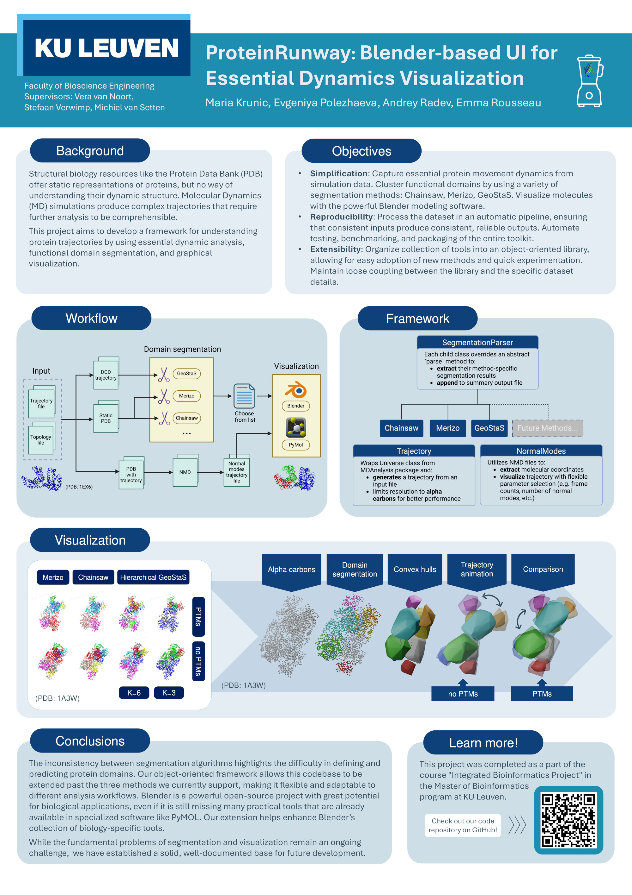

Introduction
============

Protein Runway is designed to visualize the essential dynamics for trajectories of large molucules, such as proteins. It focuses on identifying key structural movements using normal mode analysis.

Key Features:

- Visualize molecular trajectories.
- Extract key movement patterns.
- Integrate with tools like `Chainsaw`, `Merizo`, `bio3D`.

Read the full details in the `paper (PDF) <https://github.com/AndrewRadev/protein-runway/blob/0a31085f934c03ef1ab02e49f1604b9424262be0/docs/source/resources/paper.pdf>`_ or take a look at this illustrated overview:

